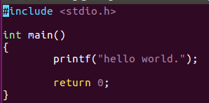
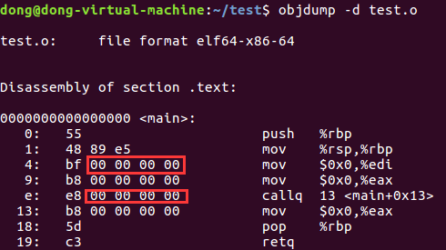
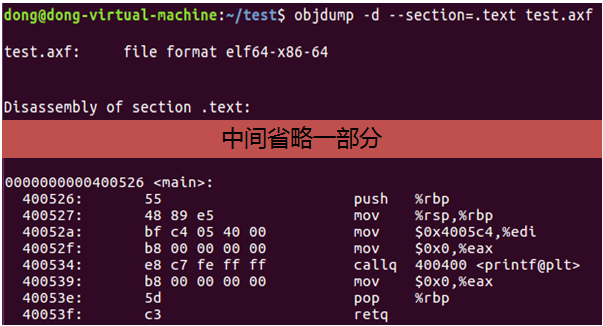
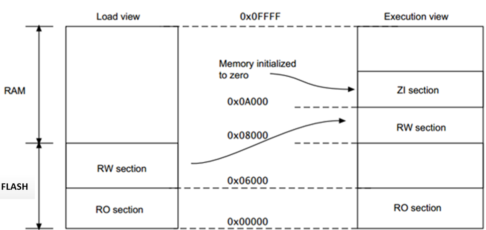
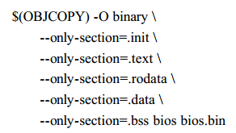
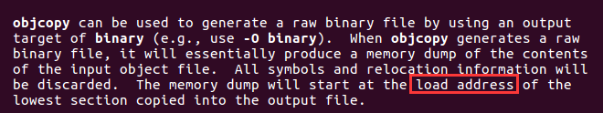
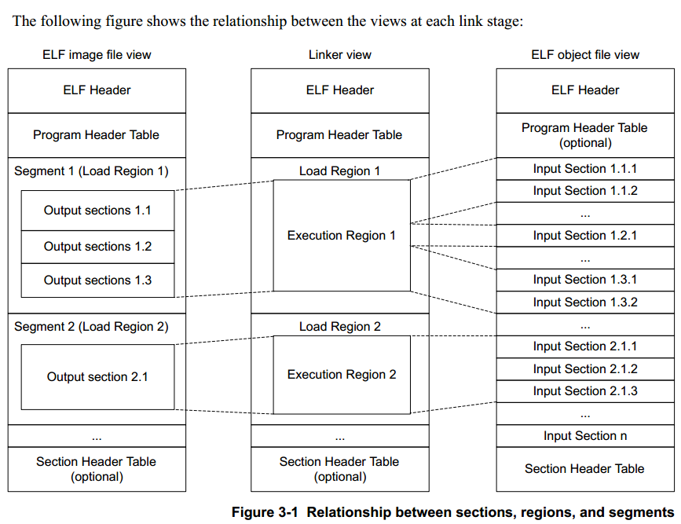
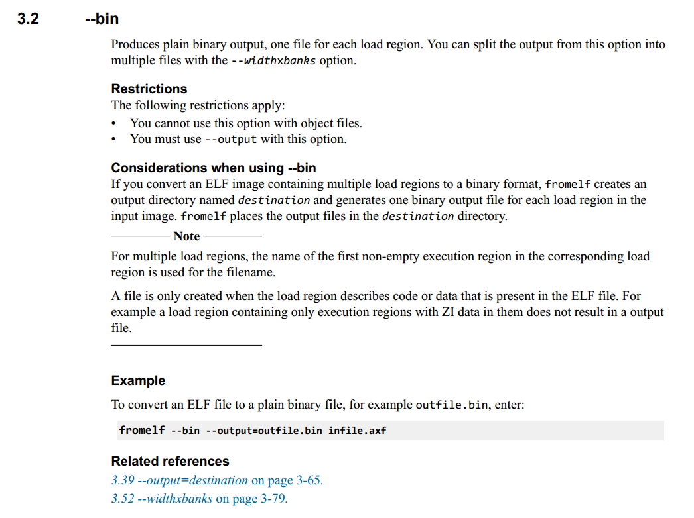

# 1 适用范围
1. 希望了解object、axf、bin文件在整个生成代码过程中的地位；
2. 希望了解芯片的链接脚本作用；
3. 谈谈对VMA和LMA的理解
4. 针对gcc的ld文件和keil的sct文件简单谈谈自己的理解。

# 2 简介
网上有不少关于分散加载文件（sct）以及链接脚本文件（ld）的介绍，其中也会涉及到许多编译原理的概念，但感觉都有点支离破碎，无法很好形成一个系统的理解，这里简单谈一下当前对这部分的理解，方便以后复习。

## 2.1 文件的来龙去脉
    .c    ->    .o    ->    .axf    ->.bin
由.c汇编成.s，再由.s编译成.o，然后由linker将各个.o链接成.axf（可执行文件），最后由objcopy抽取.axf中的各种（output section），生成.bin。

## 2.2 .o和.axf的关系

使用linux虚拟机简单写一个c文件，然后用gcc生成对应的.o和.axf文件。

objdump可以查看elf格式文件的section的反汇编，这里我们比较.o和.axf的main部分，从而了解链接器将.o文件变成.axf过程中进行了什么加工。

在链接之前，.o的.text section中的main部分是0x00000000，这是因为在未进行空间地址分配之前，.o的.text section起始地址就是0x00000000，这时候的地址只是一个保留值，链接时候会用一个有意义的虚拟内存地址（VMA）覆盖。

为生成.axf文件，除了test.o，linker还会将一些库文件也加进来。Linker负责给这些代码分配空间和地址，图上的最后结果是main部分被分配到0x00400526（VMA），printf也有了的虚拟内存地址。对于程序来说，他会到自己的虚拟地址空间（VMA）取指令，然后执行。

链接过程我们关心主要的是：地址和空间分配（Address and Storage）和重定位（Relocation）。

# 3 地址视图

*gcc ld中的LMA类比armlink中的load address*

*gcc ld中的VMA类比armlink中的excution address*

后面一般使用LMA和VMA说明相关内容。

## 3.1 大型操作系统平台（CPU从RAM取指令跑代码）

对于类似Linux这种大型操作系统来说：
1.	可以将编译链接后生成的.axf（可执行文件）文件保存在系统中的磁盘中；
2.	当用户需要运行.axf里面程序的时候，是不需要生成.bin文件的，直接根据磁盘中.axf的文件头将程序通过loader加载到LMA中（RAM），如果是普通PC电脑LMA=VMA，也就是说，程序被加载到RAM什么地方，也就在什么地方运行，这时候把.axf里面的ENTRY地址（VMA）传递给PC寄存器，就可以直接运行程序了。

## 3.2 小型平台（CPU从Flash取指令跑代码）

与上一个例子不一样，这里的CPU从flash取指令，而不会先拷贝到RAM中运行，一般CortexM应用是不会用到loader的，那这种情况怎么跑程序呢？以上图为例：
1.	最简单的方法就是将.axf文件中的RW section和ZI section扣出来烧写进RAM中对应的VMA，将RO section烧写进FLASH中对应的VMA。但是这样做只要掉电，RAM里面的数据就丢失了，需要再次下载，单单这一个原因就否决这种做法了。
2.	将.axf文件中的RO section烧写进FLASH中对应的VMA，然后将RW section和ZI section也烧进FLASH，让程序在刚开始运行的时候，在启动文件中将RW section和ZI section搬到RAM中对应的VMA，然后正式开始执行，这种做法便是最普遍的使用方式。（一般ZI section不会烧写进flash，会在启动文件中直接赋0）

有人会问，LMA去哪里了？LMA一开始是应用在大型OS上，用于加载程序的，但是CortexM并不会加载程序（没跑linux系统），所以在这种情况下，LMA似乎有了不一样的作用。针对第2种方式，大家都希望最终烧进FLASH的是代码紧凑，占空间尽量小的.bin文件，那么这个.bin文件又是怎么得到的？一般情况下，.bin文件是objcopy工具从.axf文件中将一部分内容扣出来组成的，objcopy的指令选项可以指定需要扣的section，如图 3.2。

那么这些section在.bin中是如何分布是谁决定的呢？

没错，就是LMA！objcopy从最开始section的LMA开始，一直复制到到最尾section的LMA，中间没有代码的地方补0，最后生成.bin文件，也就是说对于这种情况，可以将.bin文件看成是LMA空间。
芯片跑程序的顺序是：
1.	用工具链生成.axf文件；
2.	然后用其他外部工具（例如objcopy）将.axf的RO section，RW section根据各自的LMA扣出来，组成一个.bin文件；
3.	然后通过烧录工具，直接将.bin烧写到芯片的flash那里去。

以图 3.1为例，假设向量表映射到flash的地址0x00000，在烧写完.bin之后，芯片上电，CortexM内核决定了PC寄存器的值会从0x00004去取（也就是RO section的第二字），并开始执行程序，在程序开始执行之后不久，又会将LMA中的RW section移到VMA中，因为RO section的LMA等于VMA，所以不需要搬。有一个概念很重要：“LMA”中RO、RW的所在地址都是临时的，他们所在的真正位置（即链接时候设置的地址值）都必须在程序初始化时由相应程序，将他们移动到相应的地方（如果LMA！=VMA）。

## 3.3 小型平台（CPU开始从ROM取指令，后面从RAM取指令跑代码）
某些特别的CortexM应用跑代码是在RAM上跑的（也即从RAM上获取指令），当这样使用的时候一般芯片内部会有一个固化bootloader（存放在芯片ROM中的一段代码）来充当类似loader的角色。

1. 用工具链生成.axf文件；
2. 然后用其他外部工具（例如objcopy）将.axf的RO section，RW section根据各自的LMA扣出来，组成一个.bin文件；
3. 然后通过烧录工具，直接将.bin烧写到“bootloader指定的flash地址”。

以图 3.1为例，假设向量表映射到ROM的某个位置P，在烧写完.bin之后，芯片上电，CortexM决定了PC寄存器的值会从ROM中的P+0x0004取，这个PC值会导致跳到固化的bootloader中运行，然后在bootloader中会把“bootloader指定的flash地址”中的.bin文件搬运到“LMA中，即上图中的0x00000”，然后将PC寄存器的值指向第二个字，也就是RO section的第二字（0x00004），并开始执行程序，在程序开始执行之后不久，又会将LMA中的RW移到VMA中，因为RO section的LMA等于VMA，所以不需要搬。

# 4 脚本文件

## 4.1 .ld（gcc的ld用）
- location counter与VMA有直接关系，与LMA无直接关系，具体看VMA和LMA在ld.pdf中的定义。ld脚本文件中location counter的增加和减少，要考虑VMA的变化而不是LMA的变化。
- 决定LMA的主要因素有三个：AT、指定VMA、memory region，当这三个因素都不存在的时候，LMA=VMA。（优先级好像是：AT > 指定VMA > memory region，不确定是不是会有优先级关系）

## 4.2 .sct（keil的armlink用)

- Region是armlink的术语，gcc没有这样的说法。
- Load region的root region（第一个excution region）是不会被搬运的，也就是说这部分等价于LMA=VMA（LMA和VMA在gcc中用于section，这里用于region只是类比一下）。
- Armlink会给每个region（load region+ execution region）做一些标号，用$$表示。

当使用.sct文件控制链接过程时：

*The linker generates Image$$region_name symbols for every execution region present in the image（执行视图的地址）*

*The linker generates Load$$ region_name symbols for every execution region present in the image（加载视图的地址）*

*The linker generates Load$$LR$$load_region_name symbols for every load region present in the image（这部分加载视图和执行视图的地址是一样的）*

不使用.sct文件控制链接过程时：

*ER_RO, for the read-only execution region.（默认region名字）*

*ER_RW, for the read-write execution region. （默认region名字）*

*ER_ZI, for the zero-initialized execution region. （默认region名字）*

*Image$$RO$$Base（与section相关的标号，注意section和region区别）*

*Image$$RW$$Base（与section相关的标号，注意section和region区别）*

*Image$$ZI$$Base（与section相关的标号，注意section和region区别）*

- 基于C库实现STACK和HEAP分配，参考《DUI0377G_02_mdk_armlink_user_guide》第7.1.4章节
- __at指令好像是指到VMA而不是LMA，跟gcc相反
- 用fromelf文件将elf文件转化成.bin，参考《DUI0459F_02_mdk_fromelf_user_guide》，对于多个load region，会导致产生多个.bin文件，一般需要另外将他们合并。

# 5 参考资料 

《杜云海的arm学习报告系列》

《DUI0377G_02_mdk_armlink_user_guide》

《DUI0459F_02_mdk_fromelf_user_guide》

《ld》

《GCC的链接脚本学习笔记》blog.chinaunix.net/uid-2595338-id-2139549.html

《VMA vs LMA?》 www.embeddedrelated.com/showthread/comp.arch.embedded/77071-1.php

《程序员的自我修养》
